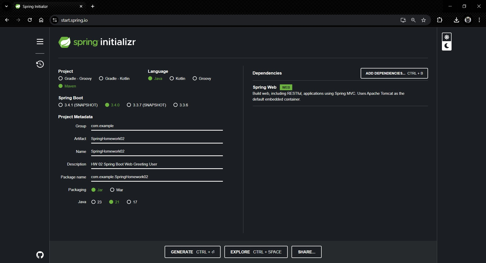
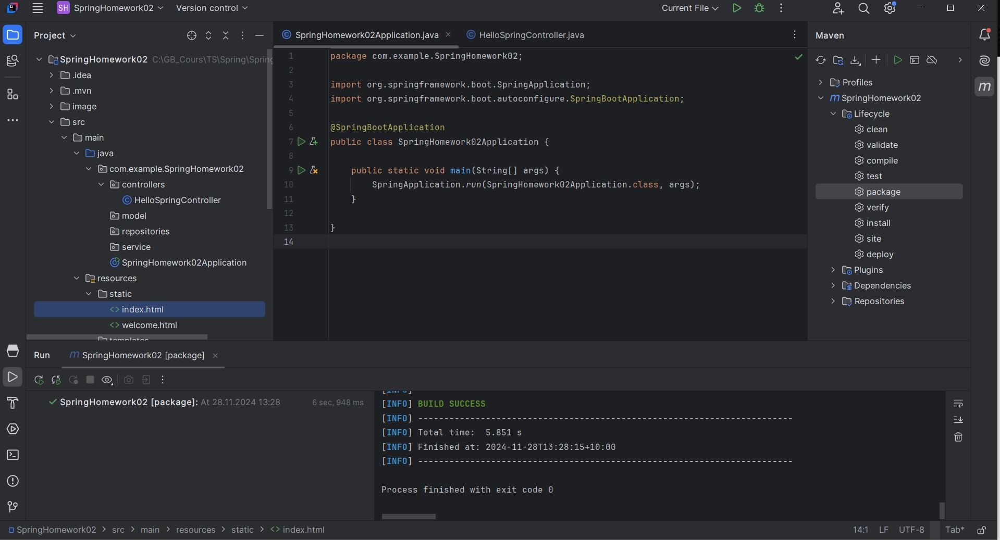
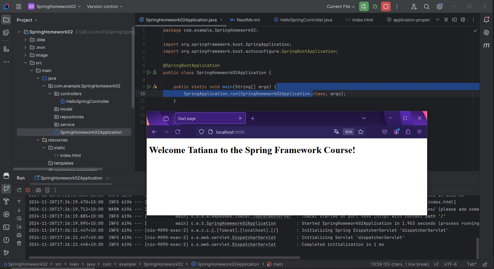

# Урок 2. 
Основы Spring. Spring Boot

Задание: 
Используя Spring Boot, создайте простое веб-приложение, 
которое приветствует пользователя на главной странице.

----------------------------------------------------------

## Демонстрация решения:

